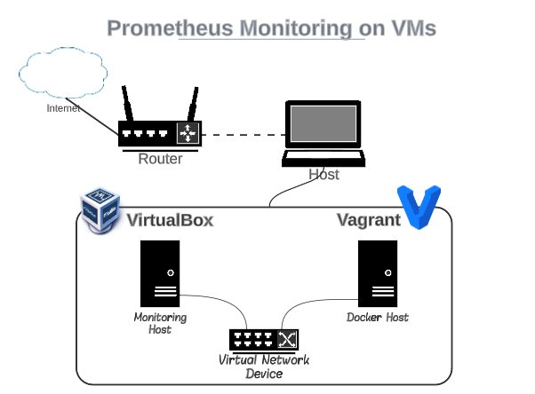

# Prometheus Monitoring Deployment Guide

Welcome to the automated deployment solution for a Prometheus monitoring with integrated Grafana. This solution employs Vagrant for environment creation. To proceed, kindly follow these steps:

 - Clone the repository containing the necessary resources.
 - Open the directory within your terminal application.
 - Execute the command `vagrant up` to initiate the deployment process.
 - Wait until the environment initialization process is completed.

#### System Requirements:

For a seamless experience, ensure your computing device (laptop or PC) meets the following specifications:

 - RAM: 8 GB or more
 - Disk Space: 80 GB or more
 - CPU: Intel/AMD x64 with virtualization support

Furthermore, the following software is essential for the deployment process:

 - VirtualBox 6.1+: https://www.virtualbox.org/wiki/Downloads
 - Vagrant 2.1+: https://developer.hashicorp.com/vagrant/downloads

## Cluster Details:
The architecture of the cluster looks like:

Comprehensive details regarding the box are available here: https://app.vagrantup.com/merev/boxes/debian-11

### Environment Information:

All hosts operate on the Debian 11 operating system. Each host boasts the following specifications:

 - 1 GB RAM
 - 1 CPUs
 - 8 GB disk space

It is pertinent to note that these hardware parameters can be adjusted before provisioning by configuring the `config.vm.provider` section in the Vagrantfile. Each host has two network interfaces:

 - 1 NIC in NAT Mode: Connected to the host machine
 - 1 NIC in Host-Only Mode: Connected to a separate virtual network for isolated communication between the VMs.

The second NIC (Host-Only mode) is assigned a static IP address within a private network. 
